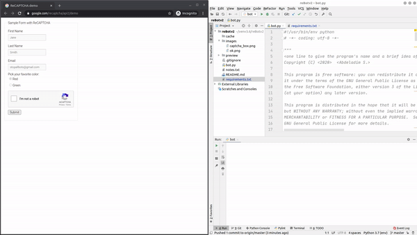

reBotv2
=====
A simple Python bot to solve reCAPTHCA v2 by audio using Google Speech recognition API.
Built with PyAutoGUI and SpeechRecognition python frameworks.

Disclaimer
=====
This is project is for **research** purposes only. It's an implementation of [INSE6150](<https://users.encs.concordia.ca/~clark/courses/1801-6150/index.html>) final project about CAPTCHA security and usability evaluation.
Any actions and/or activities related to the material contained within this repository is solely **your responsability**.

Preview
====


Requirements
====
* [Python 3.7](https://www.python.org/downloads/release/python-370/)
* [PyAutoGUI](https://github.com/asweigart/pyautogui)
* [SpeechRecognition](https://github.com/Uberi/speech_recognition)
* [clipboard](https://github.com/terryyin/clipboard)
* [Pydub](http://pydub.com/)

Installation
===
```shell script
git clone https://github.com/AbdeladimSadiki/reBotv2
cd reBotv2
pip install -r requirements.txt 
```
"scrot" must be installed to use screenshot functions in Linux. Run: 
```shell script
sudo apt-get install scrot
```

Usage
===
* First open the page where the reCAPTCHA v2 that you want to solve on Chrome.
* Make screenshots like the ones located on the `./images/` folder. (With the same file names!)
* Open a terminal and navigate to the bot folder. 
* Run the command :
```shell script
$ python bot.py
```
(See the [Preview](#Preview) section)

Compatibility
===
The script is tested on: 
* Ubuntu 19.10
* Chrome Version 83.0.4103.106
* [reCAPTCHA v2 demo](https://www.google.com/recaptcha/api2/demo)

But it should work on other platforms as well.